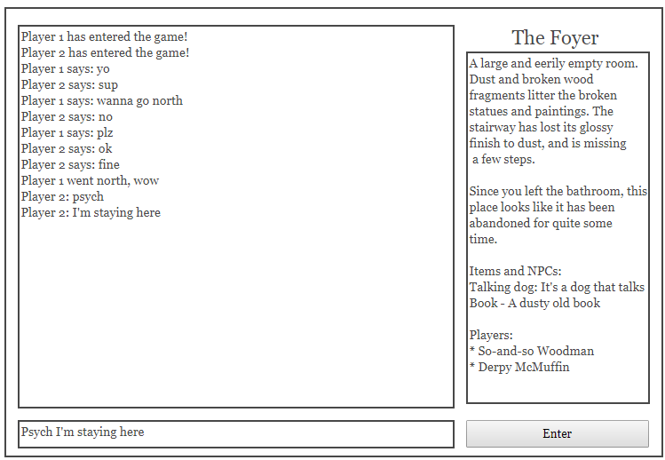
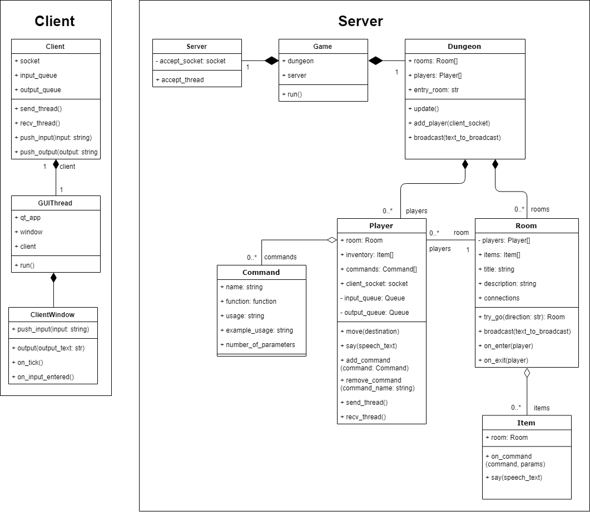
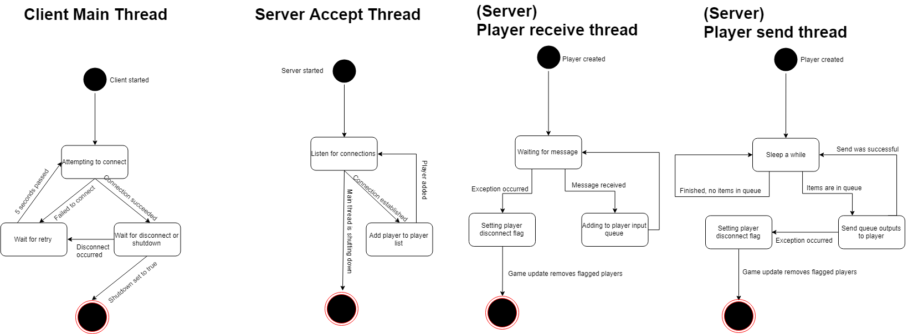
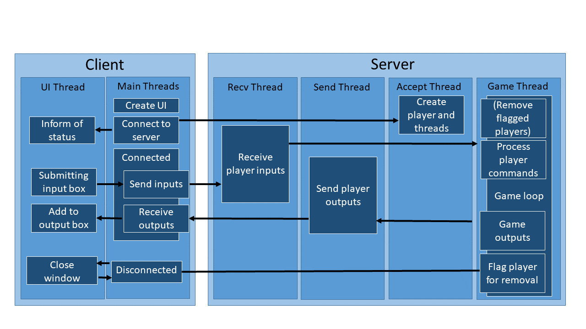

# comp260-server
GitHub URL: http://github.com/LXShades/comp260-server

# Compiling and running
* To run the server, run **__main__.py**.
* To run the client, run **Client.py**.
* A **local client** is available on the server. Comment out the line of code in Game.py to run it.

# Random ideas
You awaken in a room full of fluffy pink pillows. This must surely be a dream.
There is a door in the North.
Type 'help' at any time to see your list of commands. Consider using the 'walk into' command to 'walk into the door'.

# Custom HTML formatting tags
* <+player><-player> - A player name
* <+item><-item> - An item name
* <+command><-command> - A command name
* <+room><-room> - A room name
* <+room_info><-room_info> - Room info. This may be read and stored into a different area of the UI.
* <+room_title><-room_title> - Title of the room. This may be read and stored into a different area of the UI.

It's scary how <self-explanatory> HTML tags can be.

# GUI

* Main output box takes up the majority of the screen
* Input box is below the output box
* Right-hand panel contains the room title and description

# UML
I totally designed this entire thing before I made it.

## Class heiarchy diagram

## State diagram

## Sequence diagram
